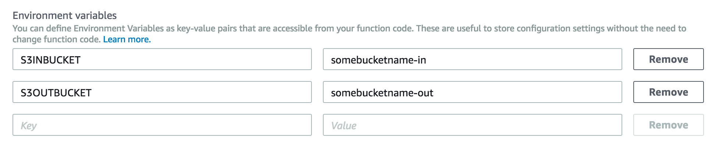
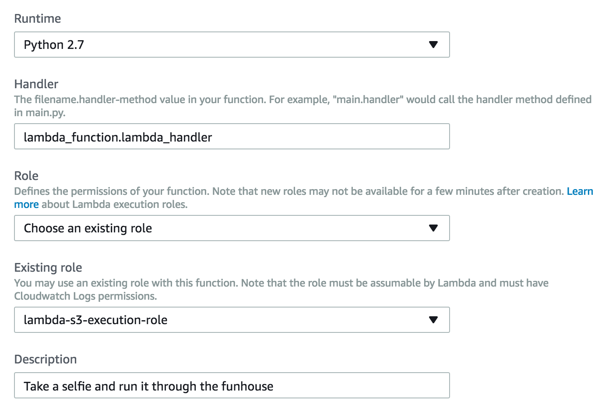

# Python OpenCV+DLIB module for AWS Lambda

## UPDATES IN PROGRESS - YMMV

## Description
This is a simple script that builds a deployment package including OpenCV compatible with the AWS Lambda Python runtime. The dynamic library is compiled with all extended instruction sets supported by Lambda CPU and binaries are stripped to save space. You simply need to follow the instructions below to use.

**Original work for this was forked from: https://github.com/aeddi/aws-lambda-python-opencv**

**Needs to be built on an Amazon Linux instance. dlib requires >1GiB of memory to build, so use at least a T2.small - sorry that puts you out of the FREE tier**

## Using this module
*Currently this is for Python 2.x.*

Just running the default python code isn't much help.  But if your changes are simple you can reuse my pre-built package.  To do that:
1) Download and unzip my pre-built zip
2) add your code inside the file `lambda_function.py`
3) If you just need additional pre-built data/files, copy in your additional data files.
4) zip it back up
5) upload to your S3 bucket for lambda to use

If you need to **build** additional dependencies, you'll need to update the build.sh and follow the instructions in the *Building* section below.  To do that: 
1) download or fork this repo
2) update files `build.sh`
3) rebuild as described below

You can reuse the basic example python code, keep in mind it assumes you are going to use S3 for moving data in and out of your function.  So in your lambda setup in the AWS console add values for `S3OUTBUCKET` and `S3INBUCKET`.  Like this:



Again, assuming you are using S3 you'll want to create an appropiate role so that Lambda can access other services in AWS.  In the screenshot below, mine is called `lambda-s3-execution-role`.




## Building this module
The goal here is to use EC2 to create a lambda packge using AWS linux, zip it up, and conveniently put it in S3 for lambda to use.  There is a build.sh that does that for us.

### Option 1: with an existing EC2 instance
(this doesn't autoterminate, so you can play around and figure broken build issues)

- Download the repo `wget https://github.com/dudash/aws-lambda-python-opencv/archive/master.zip`
- Unzip the archive `unzip master.zip`
- Launch the script `cd aws-lambda-python-opencv-master && ./build.sh`


### Option 2: without an existing EC2 instance
(this autoterminates and deletes its EBS after it finishes)


In the EC2 console, launch a new instance with:
- Amazon Linux AMI
- Role with S3 write permission
- Shutdown behavior: *Terminate*
- Make sure to auto assign a public IP
- Under Advanced Details - paste the below in the user data text field
```bash
#!/bin/bash
yum update -y
yum install -y git cmake gcc-c++ gcc python-devel chrpath

cd /tmp
wget https://github.com/dudash/aws-lambda-python-opencv/archive/master.zip
unzip master.zip
chmod 777 aws-lambda-python-opencv-master
cd aws-lambda-python-opencv-master
su -c './build.sh' ec2-user

aws s3 cp lambda-package.zip s3://<your-target-bucket>
shutdown -h now
```

- Replace *your-target-bucket* by a bucket where you want to store this lambda function
- Less than 30 min later the instance will be terminated and the archive will be available on your bucket
- You can check status of the build with `aws ec2 get-console-output --instance-id i-XXXXXXXXXXXXXXXXXX`

